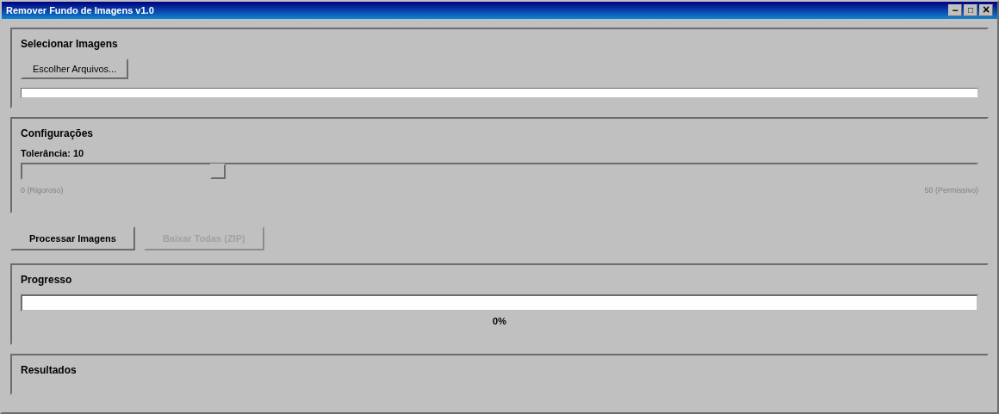
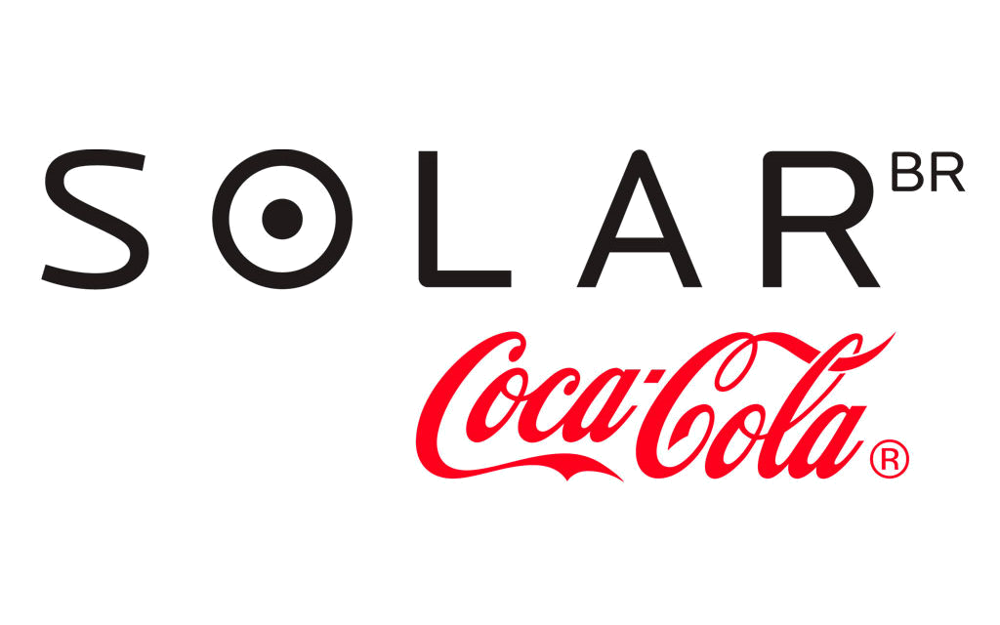

# Background Remover - Retro Edition

A nostalgic web application with a Windows 95/98 retro interface for removing white backgrounds from images, making them transparent.

## Features

- 🖼️ **Multiple Image Upload** - Select and process multiple images at once
- 👁️ **Before/After Preview** - Visualize original and processed images side by side
- ⚙️ **Adjustable Tolerance** - Fine-tune background removal sensitivity (0-50)
- 📦 **Batch Processing** - Process all selected images with progress tracking
- 💾 **Download Options** - Download individual images or all as a ZIP file
- 🎨 **Retro Interface** - Authentic Windows 95/98 visual design

## Screenshots

### Main Interface

*The retro-styled main interface with file selection and settings*

### Image Preview

*Before and after comparison of processed images*

### Processing Progress

*Real-time progress bar during batch processing*

## Installation

### Prerequisites

- Python 3.7 or higher
- pip (Python package manager)

### Setup

1. Clone the repository:
```bash
git clone <repository-url>
cd logo
```

2. Install dependencies:
```bash
pip install -r requirements.txt
```

3. Run the application:
```bash
python app.py
```

4. Open your browser and navigate to:
```
http://localhost:5000
```

## Usage

1. **Select Images**: Click "Escolher Arquivos..." to select one or more images
2. **Adjust Tolerance**: Use the slider to set the background removal sensitivity
   - Lower values (0-10): More strict, only pure white is removed
   - Higher values (30-50): More permissive, removes near-white colors
3. **Process**: Click "Processar Imagens" to start processing
4. **Download**: Download individual images or all processed images as a ZIP file

## Supported Formats

- PNG
- JPG/JPEG
- GIF
- BMP

## Project Structure

```
logo/
├── app.py                 # Flask application
├── remover_fundo.py       # Background removal module
├── requirements.txt       # Python dependencies
├── templates/
│   └── index.html        # Main HTML template
├── static/
│   ├── css/
│   │   └── style.css     # Retro styling
│   └── js/
│       └── main.js       # Frontend logic
├── uploads/              # Temporary upload folder
├── originais/            # Original images storage
└── sem_fundo/            # Processed images (transparent background)
```

## Technical Details

### Backend
- **Flask** - Web framework
- **Pillow (PIL)** - Image processing
- **Werkzeug** - File upload handling

### Frontend
- Pure HTML/CSS/JavaScript
- Retro Windows 95/98 styling
- No external dependencies

## How It Works

The application uses a pixel-based approach to detect and remove white backgrounds:

1. Converts images to RGBA format
2. Analyzes each pixel's RGB values
3. If a pixel is white (or near-white based on tolerance), sets alpha channel to 0 (transparent)
4. Preserves all other pixels with their original colors
5. Saves the result as a PNG with transparency

## Configuration

You can modify the following in `app.py`:

- `MAX_CONTENT_LENGTH`: Maximum file upload size (default: 50MB)
- `UPLOAD_FOLDER`: Temporary upload directory
- Server host and port

## License

This project is open source and available for personal and commercial use.

## Contributing

Contributions are welcome! Please feel free to submit a Pull Request.

## Acknowledgments

- Inspired by the classic Windows 95/98 interface design
- Built with Flask and Pillow

---

## Demo Images

### Example 1: Logo Processing

*Before: Logo with white background*


*After: Logo with transparent background*

### Example 2: Multiple Images

*Batch processing multiple logos*

---

**"너희는 내가 너희에게 명령한 모든 것을 지키고 행하라. 그것을 더하거나 감하지 말라."**

**申命記 12:32**

